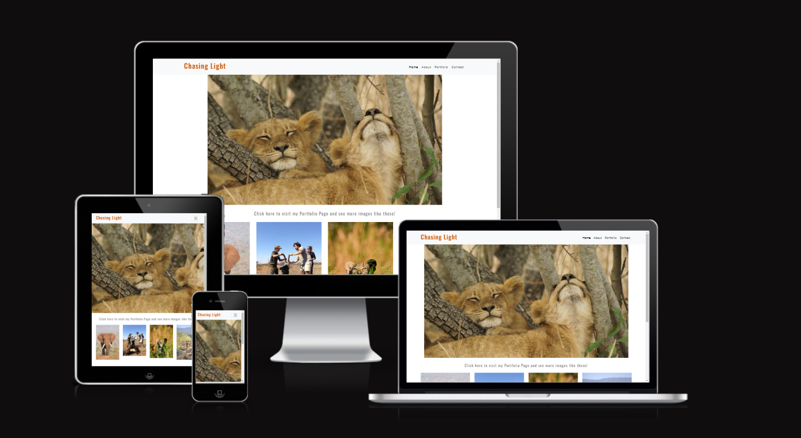

# Chasing Light Photographic Portfolio

[Link to live project](https://deanwraith24.github.io/photographic-portfolio/)

Chasing Light Photographic Portfolio is a portfolio site for my personal wildlife photography that I have taken in my time working in wildlife conservation in South Africa. The goal was to showcase my images in an easy to access and view style. The site consists of 4 pages that help to reach this goal.

### <u>Table of Contents</u>

* Planning
  * External User Goals
  * Site Owner Goals
  * Wireframes
  * Fonts, Colors and Images

* Features
  * Header
  * Footer
  * Home Page
  * About Page
  * Portfolio Page
  * Contact Page

* Future Enhancements

* Testing
  * Manual Testing
  * Validation
  * Issues

* Deployement

* Credits

### <u>Planning</u>

#### <u>External User Goals</u>
The goals for users of this site are to see a collection of photographs taken over a period of time working in wildlife conservation on various reserves around South Africa.

#### <u>Site Owner Goals</u>
The goals of the site owner are to showcase a range of images of various wildlife and wildlife experiences.

#### <u>Wireframes</u>

<u>Home Page Wireframe</u>

<u>About Page Wireframe</u>

<u>Portfolio Page Wireframe</u>

<u>Contact Page Wireframe</u>

#### <u>Fonts, Colors and Images</u>

* Fonts
The fonts for the site were sourced from [Google Fonts](https://fonts.google.com/). The heading font used is Oswald and the body font used is Lato.

* Colors
Font colors used are #CC5500 and  #777777

* Images
All the images included in the project are my personal images.

### <u>Features</u>

#### <u>Header</u>

#### <u>Footer</u>

#### <u>Home Page</u>

#### <u>About Page</u>

#### <u>Portfolio Page</u>

#### <u>Contact Page</u>

### <u>Future Enhancements</u>

The list below is some features that could be added in the future to enhance the user experience.

* Blog
A blog can be added where stories about specific images or experiences can be shared and a sign up to receive notifications of new posts can be added.

* Market Place
A page where users can order prints and have them shipped to them.

### <u>Testing</u>

#### <u>Manual Testing</u>

During the manual testing phase I used personal phones and tablets to view the site and test the various features to ensure they work as expected.

#### <u>Validation</u>
 * HTML
 For the HTML I used W3C Markup Validation Service.

 * CSS
 For the validation of the CSS I used Jigsaw CSS validatior.

#### <u>Issues</u>

### <u>Deployement</u>

The project was deployed using GitHub Pages. The steps to deploy are as follows:

 1. Open the repository and click on the settings tab.
 2. Navigate to the Pages tab in the menu on the left.
 3. Choose deploy from a branch and select main branch.
 4. Click save and you can access the deployed website from the Pages tab.

### <u>Credits</u>

The content on the site was written by myself. The About me and Awards text is made up and non-factual or real. I used W3 Schools to trouble shoot some of the speed bumps I had and to get some ideas for the code I used in my form. I also used the course work from the Code Institute LMS.
